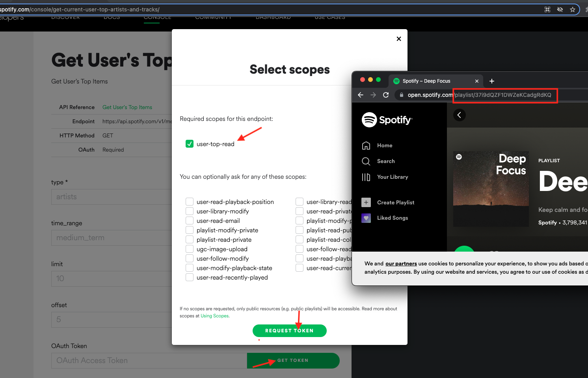
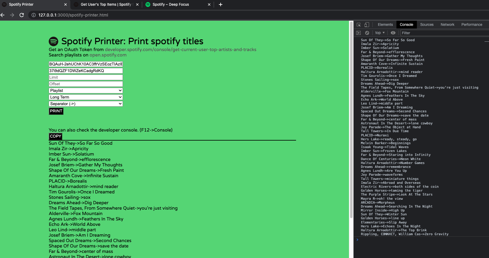

# Spotify Printer: Print spotify titles

Print your spotify lists & top artists/tracks

1- Get an OAuth Token from [developer.spotify.com/console/get-current-user-top-artists-and-tracks](https://developer.spotify.com/console/get-current-user-top-artists-and-tracks)

2- Get the playlist id. [open.spotify.com](https://open.spotify.com)

3- Fill the form and submit.

```
There is a limit in the endpoint so that please use offset to get the whole list.

Limit:100, Offset:0 -> Offset:100 -> Offset:200 ...
```



